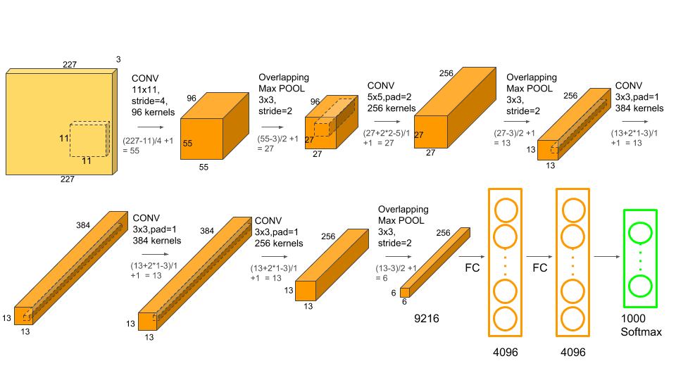

# VGG16
  
Almost all CNN architectures follow the same general design principles of successively applying convolutional layers to the input, periodically downsampling the spatial dimensions while increasing the number of feature maps.

While the classic network architectures were comprised simply of stacked convolutional layers, modern architectures explore new and innovative ways for constructing convolutional layers in a way which allows for more efficient learning. Almost all of these architectures are based on a repeatable unit which is used throughout the network.

These architectures serve as rich feature extractors which can be used for image classification, object detection, image segmentation, and many other more advanced tasks.

## LeNet:  
Yann Lecun's LeNet-5 model was developed in 1998 to identify handwritten digits for zip code recognition in the postal service. This pioneering model largely introduced the convolutional neural network as we know it today.  
 
LeNet-5 is a very simple network. It only has 7 layers, among which there are 3 convolutional layers, 2 sub-sampling (pooling) layers , and 1 fully connected layer, that are followed by the output layer. Convolutional layers use 5 by 5 convolutions with stride 1. Sub-sampling layers are 2 by 2 average pooling layers.  

Tanh sigmoid activations are used throughout the network.

parameters:60,000      
## AlexNet:  
AlexNet was developed by Alex Krizhevsky et al. in 2012 to compete in the ImageNet competition.   
The ImageNet Large Scale Visual Recognition Challenge (ILSVRC) is an annual computer vision competition. Each year, teams compete on two tasks. The first is to detect objects within an image coming from 200 classes, which is called object localization. The second is to classify images, each labeled with one of 1000 categories, which is called image classification.    
    

The general architecture is quite similar to LeNet-5, although this model is considerably larger.     

It is the first large scale convolutional neural network architecture that does well on ImageNet classification. 
AlexNet architecture looks very similar to the LeNet network. There are just more layers in total. There are five of these conv layers, and two fully connected layers before the final fully connected layer going to the output classes.   

`This architecture is the first use of the ReLU non-linearity`   

It has an error rate of 16.4 in the ImageNet Large Scale Visual Recognition Challenge(ILSVRC).

parameters:60 million

## VGG-16:      
VGG 16 was proposed by Karen Simonyan and Andrew Zisserman of the Visual Geometry Group Lab of Oxford University in 2014 in the paper “VERY DEEP CONVOLUTIONAL NETWORKS FOR LARGE-SCALE IMAGE RECOGNITION”. This model won the 1st  and 2nd place on the above categories in 2014 ILSVRC challenge.

**ARCHITECTURE:**  
The input to our ConvNets is a fixed-size 224 × 224 RGB image. The only preprocessing we do is subtracting the mean RGB value, computed on the training set, from each pixel.  
Note:   
*Max pooling is done by 2x2 size and stride of 2 and there is a padding of 1-pixel (same padding) done after each convolution layer to preserve the spatial resolution of the image after convolution.*  
*The filters we use is of the size 3x3 instead of 11x11 in AlexNet and 7x7 in ZF-Net.*   

  

* The image is passed through a stack of convolutional (conv.) layers, where the filters were used with a very small receptive field: 3x3.
* **Input Layer:** It accepts color images as an input with the size 224 x 224 and 3 channels i.e. Red, Green, and Blue.
* **Convolution Layer:** The images pass through a stack of convolution layers where every convolution filter has a very small receptive field of 3 x 3 and stride of 1. Every convolution kernel uses row and column padding so that the size of input as well as the output feature maps remains the same or in other words, the resolution after the convolution is performed remains the same.
* **Max pooling:** It is performed over a max-pool window of size 2 x 2 with stride equals to 2, which means here max pool windows are non-overlapping windows Not every convolution layer is followed by a max pool layer as at some places a convolution layer is following another convolution layer without the max-pool layer in between.
* **Fully connected layer:** The first two fully connected layers have 4096 channels each and the third fully connected layer which is also the output layer have 1000 channels, one for each category of images in the imagenet database.
* All hidden layers are equipped with the rectification (ReLU) non linearity.
## Calculation:
The formula we have is: $`(n-f+2*p)/s+1`$, where n=input volume size, f= filter size, p=padding, s=stride.
* In first 2 convolution layer padding(p)=1 and stride for convolution (s)=1 so the output after the first 2 convolution is: (224-3+2*1)/1+1=224, and the number of 3x3 filters used is 64 so the output after 2 convolutions is 224x224x64.
* After the convolution max-pooling is done with stride(s)=2 and window size(2x2), so f=2 and no padding(p=0). Therefore the output is (224-2+2*0)/2+1=112 and so the output after first 2 convolutions and maxpooling is 112x112x64.
* Again 2 convolution is performed where n=112, f=3, p=1 and s=1. Therefore, output after 2 convolutions is (112-3+2*1)/1+1=112. The number of 3x3 filters in each convolution is 128 so after 2 convolutions the output image dimension becomes 112x112x128. 
* After the convolution max-pooling is done with stride(s)=2 and window size(2x2), so f=2 and no padding(p=0). Therefore the output is (112-2+2*0)/2+1=56 and so the output after first 2 convolutions and maxpooling is 56x56x128.
* Now, 3 convolutions is performed where n=56, f=3, p=1 and s=1. Therefore, output after 2 convolutions is (56-3+2*1)/1+1=56. The number of 3x3 filters in each convolution is 256 so after 3 convolutions the output image dimension becomes 56x56x256. 
* After the 3 convolution max-pooling is done with stride(s)=2 and window size(2x2), so f=2 and no padding(p=0). Therefore the output is (56-2+2*0)/2+1=28 and so the output after first 2 convolutions and maxpooling is 28x28x256.
* Now again, 3 convolutions is performed where n=28, f=3, p=1 and s=1. Therefore, output after 3 convolutions is (28-3+2*1)/1+1=28. The number of 3x3 filters in each convolution is  so after 3 convolutions the output image dimension becomes 28x28x512. 
* After the 3 convolution max-pooling is done with stride(s)=2 and window size(2x2), so f=2 and no padding(p=0). Therefore the output is (28-2+2*0)/2+1=14 and so the output after 3 convolutions and maxpooling is 14x14x512.
* Again, 3 convolutions is performed where n=14, f=3, p=1 and s=1. Therefore, output after 3 convolutions is (14-3+2*1)/1+1=14. The number of 3x3 filters in each convolution is 512 so after 3 convolutions the output image dimension becomes 14x14x512.
*  After the 3 convolution max-pooling is done with stride(s)=2 and window size(2x2), so f=2 and no padding(p=0). Therefore the output is (14-2+2*0)/2+1=7 and so the output after 3 convolutions and maxpooling is 7x7x512.
*  Two fully connected layer of dimension 1x1x4096 is created and the  third fully connected layer which is also the output layer have 1000 channels, one for each category of images in the imagenet database.
## Why VGG is effective than previous architectures? 
* The vgg16 architecture addressed an  important aspect of ConvNet architecture design – its depth. It fix other parameters of the architecture, and steadily increase the depth of the network by adding more convolutional layers, which is feasible due to the use of very small (3×3) convolution filters in all layers. This helped increase accuracy of the network.
* Because there are now three ReLU units instead of just one, the decision function is more discriminative
* Assuming that both the input and the output of a three-layer 3 × 3 convolution stack has C channels, the stack is parametrised by $`3(3^2C^2)= 27C^2`$ weights; at the same time, a single 7 × 7 conv. layer would require $`7^2*C^2 = 49C^2`$ parameters, i.e. 81% more. Thus, implicit regularization on less parameters of each convolutional layer help this network to converge faster and perform better in spite of the larger number of overall parameters and the greater depth.
* The architecture design is uniform and simple as it uses 3x3 filter in all the convolutional layer and 2x2 max pooling for max pooling throughout the network, whereas in AlexNet and LeNet this varies in different layers.

  
**Some terms to understand:**
* Top-1 accuracy: It is the conventional accuracy: the model answer (the one with highest probability) must be exactly the expected answer.

* Top-5 accuracy: This means that any of your model 5 highest probability answers must match the expected answer.

For instance, applying machine learning to object recognition using a neural network. A picture of a cat is shown, and these are the outputs of the neural network:

Tiger: 0.4
Dog: 0.3
Cat: 0.1
Lynx: 0.09
Lion: 0.08
Bird: 0.02
Bear: 0.01

Using top-1 accuracy, you count this output as wrong, because it predicted a tiger.

Using top-5 accuracy, you count this output as correct, because cat is among the top-5 guesses.

**Configurations:**    
The table below listed different VGG architecture. We can see that there are 2 versions of VGG-16 (C and D). There is not much difference between them except for one that except for some convolution layer there is (3, 3) filter size convolution is used instead of (1, 1). These two contains 134 million and 138 million parametersrespectively.     
It is also noted that none of the networks (except for one) contain Local Response Normalisation (LRN), such normalization does not improve the performance on the ILSVRC dataset, but leads to increased memory consumption and computation time.  
    

**Results:**  
Scale jittering at test time lead to better performance(as compared to evaluating the same model at a single scale).The deepest configurations (D and E) performed the best, and scale jittering is better than training with a fixed smallest side S. The best single-network performance on the validation set is 24.8%/7.5%
top-1/top-5 error (highlighted in bold in Table). On the test set, the configuration E achieves 7.3%
top-5 error.
    

## Drawbacks:
* It is slow to train.
* Due to its depth and number of fully-connected nodes, VGG16 is over 533MB. This makes deploying VGG a tiresome task.
## Resources:
1.[Article_1](https://towardsdatascience.com/vgg-neural-networks-the-next-step-after-alexnet-3f91fa9ffe2c#:~:text=VGG%20is%20an%20innovative%20object,most%20used%20image%2Drecognition%20architectures.)  

2.[official_paper](https://arxiv.org/pdf/1409.1556.pdf)

3.[Article_2](https://medium.com/analytics-vidhya/vggnet-architecture-explained-e5c7318aa5b6)

4.[Article_3](https://neurohive.io/en/popular-networks/vgg16/)